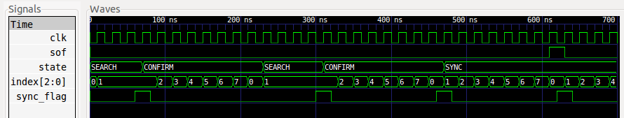

=======================
What’s New in MyHDL 0.3
=======================

:Author: Jan Decaluwe

VCD output for waveform viewing
===============================

|image|

MyHDL now has support for waveform viewing. During simulation, signal
changes can be written to a VCD output file that can be loaded into a
waveform viewer tool such as **gtkwave**.

The user interface of this feature consists of a single function,
:func:`traceSignals()`. To explain how it works, recall that in MyHDL,
an instance is created by assigning the result of a function call to an
instance name. For example:

::

    tb_fsm = testbench()

To enable VCD tracing, the instance should be created as follows
instead:

::

    tb_fsm = traceSignals(testbench)

All signals in the instance hierarchy will be traced in a VCD file
called . Note that first the argument of :func:`traceSignals()` consists
of the uncalled function. By calling the function under its control,
:func:`traceSignals()` gathers information about the hierarchy and the
signals to be traced. In addition to a function argument,
:func:`traceSignals()` accepts an arbitrary number of non-keyword and
keyword arguments that will be passed to the function call.

Signals are dumped in a suitable format. This format is inferred at the
:class:`Signal` construction time, from the type of the initial value.
In particular, :class:`bool` signals are dumped as single bits. (This
only works starting with Python 2.3, when :class:`bool` has become a
separate type). Likewise, :class:`intbv` signals with a defined bit
width are dumped as bit vectors. To support the general case, other
types of signals are dumped as a string representation, as returned by
the standard :func:`str()` function.

[warning] Support for literal string representations is not part of the
VCD standard. It is specific to **gtkwave**. To generate a standard VCD
file, you need to use signals with a defined bit width only.

Enumeration types
=================

It is often desirable to define a set of identifiers. A standard Python
idiom for this purpose is to assign a range of integers to a tuple of
identifiers, like so:

::

    >>> SEARCH, CONFIRM, SYNC = range(3)
    >>> CONFIRM
    1

However, this technique has some drawbacks. Though it is clearly the
intention that the identifiers belong together, this information is lost
as soon as they are defined. Also, the identifiers evaluate to integers,
whereas a string representation of the identifiers would be preferable.
To solve these issues, we need an *enumeration type*.

MyHDL 0.3 supports enumeration types by providing a function
:func:`enum()`. The arguments to :func:`enum()` are the string
representations of the identifiers, and its return value is an
enumeration type. The identifiers are available as attributes of the
type. For example:

::

    >>> from myhdl import enum
    >>> t_State = enum('SEARCH', 'CONFIRM', 'SYNC')
    >>> t_State
    <Enum: SEARCH, CONFIRM, SYNC>
    >>> t_State.CONFIRM
    CONFIRM

Enumeration types are often used for the state variable in a finite
state machine. In the waveform in
Section \ `1 <#vcd-output-for-waveform-viewing>`__, you see a
:class:`Signal` called ``state``. Note how the waveforms show the string
representation of the enumeration type identifiers The ``state`` signal
has been constructed with an enumeration type identifier as its initial
value, as follows:

::

    state = Signal(t_State.SEARCH)

Inferring the sensitivity list for combinatorial logic
======================================================

In MyHDL, combinatorial logic is described by a generator function with
a sensitivity list that contains all inputs signals (the signals that
are read inside the function).

It may be easy to forget some input signals, especially it there are a
lot of them or if the code is being modified. There are various ways to
solve this. One way is to use a sophisticated editor. Another way is
direct language support. For example, recent versions of Verilog have
the ``always @*`` construct, that infers all input signals. The
SystemVerilog 3.1 standard improves on this by introducing the
``always_comb`` block with slightly enhanced semantics.

MyHDL 0.3 provides a function called :func:`always_comb()` which is
named and modeled after the SystemVerilog counterpart.
:func:`always_comb()` takes a classic local function as its argument.
This function should specify the combinatorial logic behavior.
:func:`always_comb()` returns a generator that is sensitive to all
inputs, and that will run the function whenever an input changes.

For example, suppose that we have a mux module described as follows:

::

    def mux(z, a, b, sel):
        """ Multiplexer.
        
        z -- mux output
        a, b -- data inputs
        sel -- control input

        """
        def logic()
            while 1:
                yield a, b, sel
                if sel == 1:
                    z.next = a
                else:
                    z.next = b
        mux_logic = logic()
        return mux_logic

Using :func:`always_comb()`, we can describe it as follows instead:

::

    def mux(z, a, b, sel):
        """ Multiplexer.
        
        z -- mux output
        a, b -- data inputs
        sel -- control input

        """
        def logic()
            if sel == 1:
                z.next = a
            else:
                z.next = b
        mux_logic = always_comb(logic)
        return mux_logic

Note that in the first version, the sensitivity list is at the beginning
of the generator function code. This is traditionally done in
synthesizable RTL style modeling. However, the semantics of this style
are not entirely correct: at the start of the simulation, the
combinatorial output will not reflect the initial state of the inputs.
:func:`always_comb()` solves this by putting the sensitivity list at the
end of the code.

Inferring the list of instances
===============================

In MyHDL, the instances defined in a top level function need to be
returned explicitly. The following is a schematic example:

::

    def top(...):
        ...
        instance_1 = module_1(...)
        instance_2 = module_2(...)
        ...
        instance_n = module_n(...)
        ... 
        return instance_1, instance_2, ... , instance_n

It may be convenient to assemble the list of instances automatically,
especially if there are many instances. For this purpose, MyHDL 0.3
provides the function :func:`instances()`. It is used as follows:

::

    from myhdl import instances

    def top(...):
        ...
        instance_1 = module_1(...)
        instance_2 = module_2(...)
        ...
        instance_n = module_n(...)
        ...
        return instances()

Function :func:`instances()` uses introspection to inspect the type of
the local variables defined by the calling function. All variables that
comply with the definition of an instance are assembled in a list, and
that list is returned.

Inferring the list of processes
===============================

In addition to instances, a top level function may also define local
generators functions, which I will call *processes* because of the
analogy with VHDL. Like instances, processes need to be returned
explicitly, with the qualification that they have to be called first to
turn them into generators. The following is a schematic example:

::

    def top(...):
        ...
        def process_1():
            ...
        def process_2():
            ...
        ...
        def process_n():
            ...
        ...
        return process_1(), process_2(), ..., process_n()

As for instances, it may be more convenient to assemble the list of
processes automatically. One option is to turn each process into an
instance by calling it and assigning the returned generator to a local
variable. Those instances will then be found by the :func:`instances()`
function described in
Section \ `4 <#inferring-the-list-of-instances>`__.

Another option is to use the function :func:`processes()` provided by
MyHDL 0.3. This function uses introspection to find the processes, calls
each of them, and assembles the returned generators into a list. It can
be used as follows:

::

    from myhdl import processes

    def top(...):
        ...
        def process_1():
            ...
        def process_2():
            ...
        ...
        def process_n():
            ...
        ... 
        return processes()

To conclude, a top level function with both instances and processes can
use the following idiomatic code to return all of them:

::

    return instances(), processes()

Class :class:`intbv` enhancements
=================================

Class :class:`intbv` has been enhanced with new features.

It is now possible to leave the left index of a slicing operation
unspecified. The meaning is to access “all” higher order bits. For
example:

::

    >>> from myhdl import intbv
    >>> n = intbv()
    >>> hex(n)
    '0x0'
    >>> n[:] = 0xde
    >>> hex(n)
    '0xde'
    >>> n[:8] = 0xfa
    >>> hex(n)
    '0xfade'
    >>> n[8:] = 0xb4
    >>> hex(n)
    '0xfab4'

:class:`intbv` objects now have ``min`` and ``max`` attributes that can
be specified at construction time. The meaning is that only values
within ``range(min, max)`` are permitted. The default value for these
attributes is ``None``, meaning “infinite”. For example (traceback
output shortened for clarity):

::

    >>> n = intbv(min=-17, max=53)
    >>> n
    intbv(0)
    >>> n.min
    -17
    >>> n.max
    53
    >>> n[:] = 28
    >>> n
    intbv(28)
    >>> n[:] = -18
    Traceback (most recent call last):
        ....
    ValueError: intbv value -18 < minimum -17
    >>> n[:] = 53
    Traceback (most recent call last):
        ....
    ValueError: intbv value 53 >= maximum 53

When a slice is taken from an :class:`intbv` object, the return value is
a new :class:`intbv` object with a defined bit width. As in Verilog, the
value of the new :class:`intbv` object is always positive, regardless of
the sign of the original value. In addition, the ``min`` and ``max``
attributes are set implicitly:

::

    >>> v = intbv()[6:]
    >>> v
    intbv(0)
    >>> v.min
    0
    >>> v.max
    64

Lastly, a small change was implemented with regard to binary operations.
In previous versions, both numeric and bit-wise operations always
returned a new :class:`intbv` object, even in mixed-mode operations with
:class:`int` objects. This has changed: numeric operations return an
:class:`int`, and bitwise operations return a :class:`intbv`. In this
way, the return value corresponds better to the nature of the operation.

Function :func:`concat()` 
==========================

In previous versions, the :class:`intbv` class provided a method. This
method is no longer available. Instead, there is now a :func:`concat()`
function that supports a much broader range of objects.

A function is more natural because MyHDL objects of various types can be
concatenated: :class:`intbv` objects with a defined bit width,
:class:`bool` objects, the corresponding signal objects, and bit
strings. All these objects have a defined bit width. Moreover, the first
argument doesn’t need to have a defined bit width. It can also be an
unsized :class:`intbv`, an :class:`int`, a :class:`long`, or a
corresponding signal object. Function :func:`concat()` returns an
:class:`intbv` object.

Python 2.3 support
==================

Python 2.3 was released on July 29, 2003, and as of this writing, it is
the latest stable Python release. MyHDL 0.3 works with both Python 2.2
and Python 2.3. In good Python tradition, MyHDL code developed with
Python 2.2 should run without changes or problems in Python 2.3.

In general, I am not that keen on early upgrading. However, as it
happens, the evolution of Python enables features that are really
important or even crucial to MyHDL. Python 2.2 generators are the best
example: they are the cornerstone of MyHDL. But Python 2.3 also has
significant benefits, which I will summarize below.

First, generators and the ``yield`` statement are a default Python 2.3
feature. This means that statements are no longer required.

Second, Python 2.3 has a :class:`bool` type, which is implemented as a
subtype of :class:`int`. For general Python use, the implications are
rather limited - the main difference is that logical result values will
print as ``False`` and ``True`` instead of ``0`` and ``1``. However, in
MyHDL, I can use the :class:`bool` type to infer a bit width. If a
:class:`Signal` is constructed with a :class:`bool` value, it is a
single bit :class:`Signal`. One application is waveform viewing as in
Section \ `1 <#vcd-output-for-waveform-viewing>`__ In the waveform, note
how single bit signals are displayed as level changes. With Python 2.2,
the waveforms of these signals would only show value changes, which is
not as clear for single bits.

Finally, Python 2.3 is significantly faster. MyHDL code runs 25–35%
faster in Python 2.3. This is a very nice speedup compared to the small
burden of a straightforward upgrade.

Python is a very stable language, so upgrading to Python 2.3 is
virtually risk free. Given the additional benefits, I recommend
MyHDL users to do so as soon as possible. For the next major
MyHDLrelease, the new features will become required and only Python 2.3
(and higher) will be supported.

