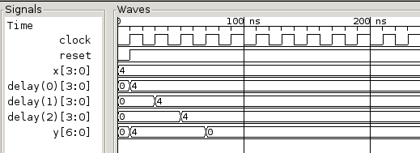

.. currentmodule:: myhdl

.. _new08:

***********************
What's new in MyHDL 0.8
***********************

Modular bit vector types
========================

Rationale
---------
In hardware modeling, there is often a need for the elegant
modeling of wrap-around behavior. :class:`intbv` instances 
don't provide this automatically, because they assert
that any assigned value is within the bound constraints.
Therefore, one has currently has to use other language
features for wrap-around modeling.

Often, this is straightforward. For example, the wrap-around
condition for a counter is often decoded explicitly, as it
is needed for other purposes. Also, the modulo
operator provides an elegant one-liner in most scenarios.

However, in some important cases the current solution is
not satisfactory. For example, we would like to describe
a free running counter using a variable and augmented
assignment as follows::

    count += 1

This is not possible with the :class:`intbv` type, as we
cannot add the modulo behavior to this description. A similar
problem exist of for a left shift as follows::

    shifter <<= 4

These operations can only supported directly with a new type.
For these reasons, it was felt that this would be a useful
addition to MyHDL.

Solution
--------

The proposed solution is to borrow the idea behind Ada modular types.
These are natural integer types with wrap-around behaviour.

The wrap-around behavior of modular types is based on the sound
mathematical concept of modulo arithmetic. Therefore, the modulus is
not limited to powers of 2.

Ada's modular type is called :class:`mod`. In MyHDL, we want also
want to give it "bit-vector" support, like :class:`intbv`. Therefore,
proposed MyHDL type is called :class:`modbv`. 

Implementation
--------------

:class:`modbv` is implemented as a subclass of  :class:`intbv`.
The two classes have an identical interface and work together
in a straightforward way for arithmetic operations.

The only difference is how the bounds are handled: out-of-bound values
result in an error with :class:`intbv`, and in wrap-around with
:class:`modbv`. The Wrap-around behavior would be defined as follows, with val
denoting the current value and min/max the bounds::

    val = (val - min) % (max - min) + min
 

Interface
---------

.. class:: modbv([val=0] [, min=None]  [, max=None])
   :noindex:

   The :class:`modbv` class implements modular bit vector types.

   It is implemented as a subclass of :class:`intbv`
   and supports the same parameters and operators.
   The difference is in the handling of the *min* and *max* boundaries.
   Instead of throwing an exception when those constraints are exceeded,
   the value of :class:`modbv` objects wraps around according to the
   following formula::
  
       val = (val - min) % (max - min) + min
       
   This formula is a generalization of modulo wrap-around behavior that
   is often useful when describing hardware system behavior. 

Conversion
----------

:dfn:`Full-range` :class:`modbv` objects are those where the max bound is
a power of 2, and the min bound is 0 or the negative of the max bound.
For these objects, conversion worked out-of-the-box because this
corresponds to the target types in Verilog and VHDL.

Currently, conversion is restricted to full-range :class:`modbv`
objects.  It may be possible to support conversion of the modulo
behavior of more general cases, but this requires more sophistication
in the converter. This may be considered in the future.

See also
--------
For a more in-depth discussion, see `mep-106`_.

.. _mep-106: http://www.myhdl.org/doku.php/meps:mep-106

``always_seq`` decorator
========================

Rationale
---------

In classical synthesizable RTL coding, the reset behavior is described
explicitly. A typical template is as follows::

    @always(clock.posedge, reset.negedge)
    def seq():
        if reset == 0:
	    <reset code>
        else:
            <functional code>

The reset behavior is described using a the top-level if-else
structure with a number of assignments under the if. A significant
piece of code at a prominent location is therefore dedicated to
non-functional behavior.

Reset behavior coding is error-prone. For a proper gate-level
implementation, most if not all registers should typically be
reset. However, it is easy to forget some reset assignments. Such bugs
are not necessarily easily detected during RTL or gate-level
simulations.

In the template, the edge that asserts reset is in the sensitivity
list. It is easy to forget this, and in that case the reset will not
behave asynchronously as intended but synchronously. Note also that it
is somewhat strange to specify an edge sensitivity when describing
asynchronous behavior.

Solution
--------
The proposed solution is to infer the reset structure automatically.
The main idea is to use the initial values of signals as the
specification of reset values. This is possible in MyHDL, because
all objects are constructed with an initial value. The assumption
is that the initial value also specifies the desired reset value.

The solution is implemented with two new MyHDL constructs. The first
one is a new decorator called :func:`always_seq`. Using this
decorator, code with identical behavior as in the previous section can
be described as follows::

    @always_seq(clock.posedge, reset=reset)
        <functional code>

The :func:`always_seq` decorator takes two arguments: a clock edge
and a reset signal. It inspects the code to find the registers, and
uses the initial values to construct the reset behavior.

The second construct is a specialized signal subclass called
:class:`ResetSignal`. It is used as follows::

    reset = ResetSignal(1, active=0, async=True)

The ResetSignal constructor has three arguments: the initial value as
usual, an *active* argument with the active level, and an *async* argument
that specifies whether the reset style is asynchronous or synchronous.

The proposed solution has some very desirable features.

Explicit reset behavior coding is no longer necessary. Code reviewers
are thus no longer distracted by non-functional code. It is
sufficient to check the initial values to verify whether the reset
value is correctly specified. Moreover, one indentation level is saved
for functional coding.

Even more importantly, the reset structure is correct by
construction. All registers are automatically included in the reset
behavior, and the sensitivity list is automatically correct according
to the reset style.

Traditionally, the reset behavior is spread out over all sequential
processes. Therefore, it has to be debugged by investigating all those
processes. Even worse, if a change in style or active level is
required, all processes are affected. In contrast, with the proposed
technique all reset features are specified at single location in the
:class:`ResetSignal` constructor. Changes are trivial. For example, to
change to an active high synchronous reset one merely has to change
the constructor as follows::

    reset = ResetSignal(1, active=1, async=False)

Occasionally, it is useful to have registers without reset at
all. The proposed technique is also useful in that case. In
particular, the :func:`always_seq` decorator accepts ``None`` as the reset
argument::

     @always_seq(clock.posedge, reset=None)

A reviewer will have no doubt what the intention is. In contrast, in
the case of a traditional always block, the reviewer may think that
the designer has delayed the detailed reset coding for later and then
forgotten about it.

Interface
---------

.. function:: always_seq(edge, reset)
   :noindex:

   The :func:`always_seq` decorator is used to describe sequential (clocked) logic.

   The *edge* parameter should be a clock edge (``clock.posedge`` or ``clock.negedge``).
   The *reset* parameter should a :class:`ResetSignal` object.

.. class:: ResetSignal(val, active, async)
   :noindex:

    This :class:`Signal` subclass defines reset signals. *val*, *active*, and *async*
    are mandatory arguments.
    *val* is a boolean value that specifies the intial value,
    *active* is a boolean value that specifies the active level.
    *async* is a boolean value that specifies the reset style:
    asynchronous (``True``) or asynchronous (``False``).

Conversion
----------

As modeling the reset behavior is a typical task in synthesizable RTL
coding, the proposed technique is fully convertible to Verilog and
VHDL.

Limitations
-----------

All registers in a process are reset
^^^^^^^^^^^^^^^^^^^^^^^^^^^^^^^^^^^^
All registers in a process are automatically included in the reset
behavior. If it is the intention that some registers should not be
reset, those registers and the corresponding code should be factored
out in a separate process.

Actually, this is not really a limitation but a feature. If some
registers in a process are reset and others not, a synthesis tool may
generate undesirable feedback loops that are active during the reset
condition. This is not good practice and probably not the intention.

Register inferencing from variables is not supported
^^^^^^^^^^^^^^^^^^^^^^^^^^^^^^^^^^^^^^^^^^^^^^^^^^^^

An important limitation is that the proposed technique is limited to
registers inferred from signals. Registers inferred from variables are
not supported, because such state variables cannot be described in
classic functions (in particular the functions required by MyHDL
decorators such as :func:`always_seq` and :func:`always`).

In fact, the reason is a Python2 limitation. Currently, to infer
registers from variables, one has to use the :func:`instance` decorator and
declare the state variables outside an infinite ``while True`` loop.

In Python3, this limitation can be lifted with the introduction of the
``nonlocal`` declaration. This will make it possible for functions to
modify variables in the enclosing scope. It should be possible to
adapt the :func:`always_seq` and :func:`always` decorators to support such
variables.

See also
--------

For a more in-depth discussion, see `mep-109`_.

.. _mep-109: http://www.myhdl.org/doku.php/meps:mep-109

Other improvements
==================

Conversion of top-level class methods
-------------------------------------

Often it is desirable to embed an HDL module description in
a class.  Previous versions would only convert a class method
if it was not the top-level.  This release adds the conversion
of top-level class methods.

Example
^^^^^^^^

.. code-block:: python

   class DFilter(object):
       def __init__(self,delay_length=3,fs=1):
           <init code>   
       def nulls(self):
           <support method code>
       def m_top(self,clock,reset,x,y):
           <myhdl module code>

   clock = Signal(bool(0))
   reset = ResetSignal(0,active=0,async=True)
   x = Signal(intbv(0, min=-8, max=8))
   y = Signal(intbv(0, min=-64, max=64))   
   
   filt = DFilter()
   toVerilog(filt.m_top,clock,reset,x,y)
   toVHDL(filt.m_top,clock,reset,x,y)

See also
^^^^^^^^
For a more in-depth discussion, see `mep-108`_.

.. _mep-108: http://www.myhdl.org/doku.php/meps:mep-108

Tracing lists of signals
------------------------
Tracing lists of signals is now supported.
Contributed by Frederik Teichtert, http://teichert-ing.de .
The following shows how the list of signals are displayed
in a waveform viewer

.. code-block:: python

   delay_taps = [Signal(intbv(0,min=-8,max=8)) for ii in range(3)]

``library`` attribute for :func:`toVHDL`
----------------------------------------
:func:`toVHDL` now has a ``library`` function that
can be used to set the library name in the
VHDL output. The assigned value should be a string.
The default library is "work".

``timescale`` attribute for :func:`traceSignals`
------------------------------------------------
:func:`traceSignals` now has a ``timescale`` attribute
that can be used to set the timescale
in the VCD output. The assigned value should be a string. 
The default timescale is "1ns".

Acknowledgments
===============

Several people have contributed to MyHDL 0.8 by giving feedback,
making suggestions, fixing bugs and implementing features.
In particular, I would like to thank
Christopher Felton and Frederik Teichert.

I would also like to thank `Easics`_ for 
the opportunity to use MyHDL in industrial projects.

.. _`Easics`: http://www.easics.com

